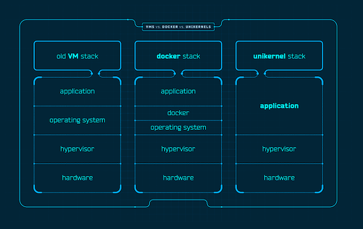

# unikernel-z
A unikernel for the Network of Momentum

### Basics
<p align="center">
  
  <br>
  <a href="https://dl.acm.org/doi/10.1145/2557963.2566628">Unikernel Explained</a> | <a href="https://ocaml.org/">Ocaml</a> | <a href="https://mirage.io/docs/overview-of-mirage">MirageOS</a>

### OCaml

The unikernel will be written in OCaml, a functional programming language known for its expressiveness, safety, and efficiency. OCaml's strong type system and static analysis tools help minimize programming errors, making it well-suited for building reliable and secure systems like unikernels. Additionally, OCaml's lightweight runtime and efficient garbage collector contribute to the overall performance and resource efficiency of the unikernel. By leveraging OCaml's features -- along with the Mirage library -- we aim to deliver a robust and high-performance unikernel system that meets the unique requirements of the Network of Momentum.

```OCaml
let register ?(argv = default_argv) ?(reporter = default_reporter ()) ?src name
    jobs =
  if List.exists Functoria.Impl.app_has_no_arguments jobs then
    invalid_arg
      "Your configuration includes a job without arguments. Please add a \
       dependency in your config.ml: use `let main = Mirage.main \
       \"Unikernel.hello\" (job @-> job) register \"hello\" [ main $ noop ]` \
       instead of `.. job .. [ main ]`.";
  let first =
    [ runtime_args argv; backtrace; randomize_hashtables; gc_control ]
  in
  let reporter = if reporter == no_reporter then None else Some reporter in
  let init = Some first ++ Some delay_startup ++ reporter in
  register ?init ?src name jobs
```
### Mirage
MirageOS uses the OCaml language, with libraries that provide networking, storage and concurrency support that work under Unix during development, but become operating system drivers when being compiled for production deployment.

## Proposal
This proposal aims to develop a specialized operating system optimized for running a NoM nodes with dual coin support over dual proof-of-work/proof-of-stake (PoW/PoS) consensus mechanism. The primary objective is to achieve feeless transactions by leveraging the unique features in a multi-chain architecture. The proposal focuses on delivering a lightweight, efficient, and secure unikernel solution tailored specifically for the Network of Momentum,

### Phases 
#### Phase 1: Testnet
- High-level overview of main tasks:
```
    Develop the core components of the Zenon Unikernel, including support for PoW/PoS consensus mechanism, and networking capabilities.
    Optimize resource usage and performance for efficient operation within a unikernel environment.
    Implement basic security measures to protect against common threats and vulnerabilities.
```
- Completion of Phase 1 will be measured by:
```
    Successful implementation of PoW+PoS consensus mechanism within the unikernel.
    Demonstrable improvement in resource efficiency and performance.
    Deployment of a testnet version of unikernel-z for community testing and feedback.
```
#### Phase 2: zApps 
- High level overview of main tasks:
```
    Enhance the security features of the unikernel by implementing advanced cryptographic algorithms and secure communication protocols.
    Integrate support for smart contracts and decentralized applications (zApps) within the unikernel environment.
    Conduct comprehensive testing and optimization to ensure reliability, scalability, and compatibility with Zenon's blockchain network.
```
- Completion of Phase 2 will be measured by:
```
    Implementation of advanced security measures and cryptographic protocols to safeguard the integrity and confidentiality of transactions.
    Successful integration of smart contract support, enabling the execution of decentralized applications within the unikernel environment.
    Validation of performance improvements and scalability enhancements through rigorous testing and benchmarking.
```
#### Phase 3: Adoptions
- High level overview of main tasks:
```
    Finalize documentation and deployment procedures for the unikernel-z, providing comprehensive guidance for node operators and developers.
    Prepare for mainnet deployment and community adoption, including outreach efforts and educational initiatives.
    Address any remaining issues or optimizations identified during testing and community feedback.
```
- Completion of Phase 3 will be measured by:
```
    Completion of comprehensive documentation covering installation, configuration, and maintenance of the Zenon Unikernel.
    Successful deployment of the Zenon Unikernel on the mainnet, enabling feeless transactions and supporting the growth of the Zenon ecosystem.
    Resolution of any outstanding issues or optimizations based on community feedback and testing results.
```
